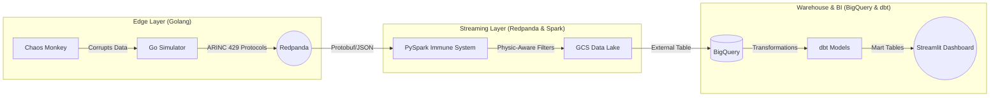

# ✈️ C-MAPSS Agentic Factory 4.0: Telemetry & Chaos Monitor


[](https://www.python.org/downloads/release/python-3110/)
[](https://www.terraform.io/)

An Enterprise-grade end-to-end data pipeline for real-time aeroengine telemetry monitoring, featuring **Chaos Engineering** simulation and an **AI-Ready Immune System** to detect and neutralize adversarial data attacks.

---

## 🏗️ Architecture

The pipeline follows a modern **Medallion/Decoupled** architecture:



---

## 🛡️ The "Immune System" (Data Quality)

This project simulates 10 different cyber-attacks by **Morgoth** (Adversarial Data poisoning). The PySpark `TelemetryShield` protects the Data Lake by detecting:
*   **Sensor Freeze**: Detecting frozen P30 values during RPM changes.
*   **Thermocouple Break**: Physics-based validation (T50 < T2 during flight).
*   **Stuxnet-style Drift**: Detecting inverse correlation between fuel flow and exhaust temperature.
*   **SLA Breach**: Monitoring real-time transport latency.
*   **Zombie State**: Detecting time-cycle paradoxes for specific engine units.

---

## ✅ DE Zoomcamp Rubric Checklist

- [x] **Cloud**: Infrastructure as Code via **Terraform** (GCS, BigQuery).
- [x] **Data Ingestion**: **Go Simulator** streaming ARINC 429 frames to Kafka.
- [x] **Data Warehouse**: **BigQuery** with External Tables for seamless GCS integration.
- [x] **Transformations**: **dbt** complex models with partitioning and clustering.
- [x] **Dashboard**: **Streamlit** + **Plotly** for real-time engine health visualize.
- [x] **Streaming**: **PySpark Structured Streaming** with custom stateful logic.
- [x] **Reproducibility**: Comprehensive **Makefile** and **CI/CD** via GitHub Actions.

---

## 🚀 Quick Start (local development)

### Prerequisites
1.  **Google Cloud Project**: You need an active GCP project and a Service Account key with BigQuery and Storage Admin roles.
2.  **Tools**: Go 1.22+, Python 3.11+, Docker, Terraform.

### 1. Preparation
Place your JSON key in the root of the project as `gcp-creds.json`.
```bash
# Setup local environment and dependencies
make setup
```

### 2. Provisioning
```bash
# Initialize and apply Terraform
make terraform-apply PROJECT_ID="your-project-id"

# Upload seed data to fix BQ external table autodetection
make seed-lake
```

### 3. Execution
```bash
# Initialize local Data (Parses NASA .txt files to SQLite)
make init-db

# Start Redpanda and Streamlit Dashboard
make infra-up

# Start the Telemetry Generator
go run cmd/simulator/main.go

# Start the Immune System (PySpark)
uv run python3 streaming/consumer.py
```

### 4. Review
Open the following links to monitor the factory:
*   **Dashboard**: `http://localhost:8501`
*   **Redpanda Console**: `http://localhost:8080`

---

## 🛠️ Project Structure
*   `cmd/simulator/`: Golang source for the edge telemetry generator.
*   `streaming/`: PySpark Structured Streaming logic (`processors.py` contains the Immune System).
*   `dbt/`: SQL transformations and warehouse models.
*   `dashboard/`: Streamlit source code.
*   `terraform/`: IaC files for GCP resources.

---
*Created as a final project for Data Engineering Zoomcamp 2026. Lead Developer: @burundu4ok2000*
