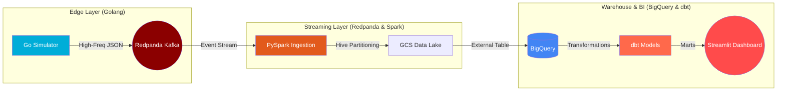

# ✈️ C-MAPSS Factory 4.0: Scalable Engine Telemetry Pipeline


[](https://go.dev/)
[](https://www.python.org/)
[](https://spark.apache.org/)
[](https://www.terraform.io/)
[](https://www.getdbt.com/)

**C-MAPSS Factory 4.0** is an Enterprise-grade End-to-End Data Engineering pipeline. The project simulates a fleet of aircraft engines generating high-frequency telemetry in real-time, ingests this massive stream using a modern distributed stack, and delivers analytical insights through a cloud data warehouse.

Developed as a final project for **Data Engineering Zoomcamp 2026**.

---

## 🏗️ Architecture (Medallion / Decoupled)

The pipeline is built on a modern streaming architecture with a strict separation of concerns (Ingestion, Processing, Storage, Analytics):



---

## ⚙️ Core Data Flow

* **High-Throughput Edge Generation:** A custom Golang simulator acts as the edge device, simulating multi-sensor physics and streaming millions of telemetry points directly to Kafka in seconds.
* **Robust Spark Ingestion:** PySpark 4.1.1 consumes the Kafka stream, standardizes the schema, and flushes data into Google Cloud Storage (GCS).
* **Cost-Optimized Storage:** Parquet files are stored in GCS using Hive partitioning (`processing_date=.../unit_number=...`) to minimize BigQuery scan costs.
* **Zero-Copy DWH:** BigQuery External Tables automatically discover GCS partitions, allowing analytical queries without data duplication.
* **Analytics Engineering:** `dbt` handles the staging and mart layers, calculating complex metrics like moving averages for engine exhaust temperatures (EGT Margin).

---

## ✅ DE Zoomcamp Rubric

- [x] **Cloud (IaC):** Infrastructure fully defined and provisioned via **Terraform** (GCS Bucket + BigQuery Dataset).
- [x] **Data Ingestion (Streaming):** **Golang simulator** streams ARINC 429 frames to **Redpanda** (Kafka).
- [x] **Data Warehouse:** **BigQuery** uses External Tables to read partitioned Parquet files directly from GCS.
- [x] **Transformations:** **dbt** is used for data staging (`stg_telemetry`) and smoothing/aggregating metrics (`mart_engine_health`).
- [x] **Dashboard:** Interactive UI built with **Streamlit** and **Plotly** to monitor engine degradation.
- [x] **Streaming Processing:** **PySpark 4.1.1** handles structured streaming and data lake sinking.
- [x] **Reproducibility (Extra Mile):** Fully automated via **Makefile**, **Docker Compose** containerization, and a configured **CI/CD** pipeline (GitHub Actions).

---

## 🚀 Quick Start

### Prerequisites
1. **Google Cloud Project**: An active GCP project and a Service Account key with `BigQuery Admin` and `Storage Admin` permissions.
2. **Local Stack**: Go 1.22+, Python 3.11+, `uv` (fast Python package manager), Docker, Terraform.

### 1. Environment Setup
Place your GCP JSON key in the root of the project as `gcp-creds.json`.
```bash
# Install local dependencies (Go modules and Python packages via uv)
make setup
```

### 2. Cloud Infrastructure Deployment
```bash
# Initialize and deploy GCP resources (Replace with your Project ID)
make terraform-apply PROJECT_ID="de-zoomcamp-2026-485615"

# Upload a seed file to ensure correct BigQuery schema initialization
make seed-lake
```

### 3. Run The Factory
```bash
# Spin up Redpanda (Kafka) and the Streamlit Dashboard
make infra-up

# Initialize the local SQLite database containing engine blueprint data
make init-db

# Open THREE separate terminals to run the pipeline components:

# Terminal 1: Start the Telemetry Generator (Edge Device)
go run cmd/simulator/main.go

# Terminal 2: Start the PySpark Ingestion Consumer
uv run python3 streaming/consumer.py

# Terminal 3: Build the dbt analytics (Run after data accumulates in GCS)
cd dbt && uv run dbt build
```

### 4. Monitoring
* **Streamlit Dashboard**: `http://localhost:8501`
* **Redpanda Console**: `http://localhost:8080`

---

## 📂 Project Structure
* `cmd/simulator/` — Source code for the Go-based telemetry generator (Edge Node).
* `internal/` — Core simulation physics engine, ORM, and broker logic.
* `streaming/` — PySpark Structured Streaming consumer.
* `dbt/` — SQL models, data marts, and tests.
* `dashboard/` — Source code for the analytical UI (Streamlit).
* `terraform/` — HCL IaC manifests for Google Cloud deployment.

---
*Developed by Stan_Buren | C-MAPSS Factory Initiative 2026*

